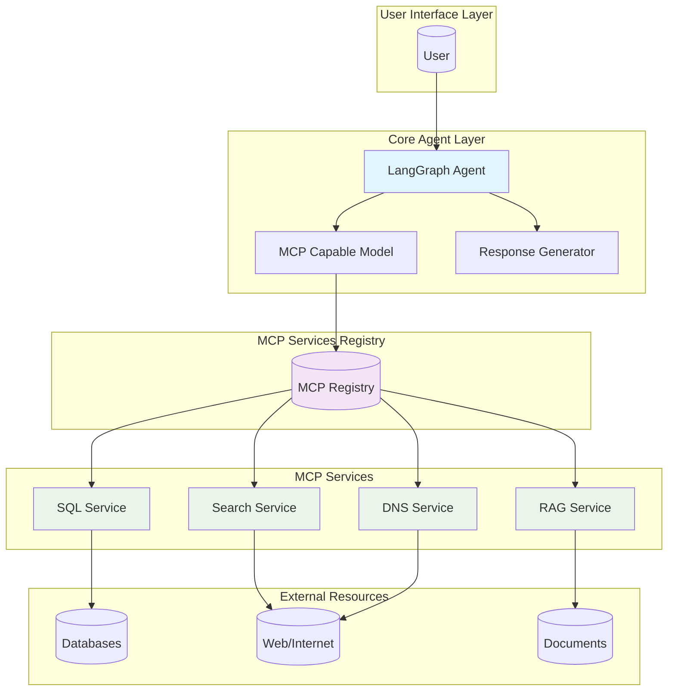

# AI Agent Architecture Diagram

## Architecture Overview

The AI Agent follows a Model Context Protocol (MCP) architecture where:

1. **User** submits natural language requests to the LangGraph Agent
2. **LangGraph Agent** coordinates the workflow and delegates tasks
3. **MCP Capable Model** generates appropriate tool calls to MCP services
4. **MCP Registry** maintains a catalog of available services
5. **MCP Services** provide specialized capabilities:
   - **RAG Service**: Document retrieval and ingestion
   - **Search Service**: Web search functionality
   - **SQL Service**: Database query generation and execution
   - **DNS Service**: Hostname resolution
6. **External Resources** provide the actual data and services

This architecture allows for flexible integration of various tools and services while maintaining a consistent interface through the MCP protocol.