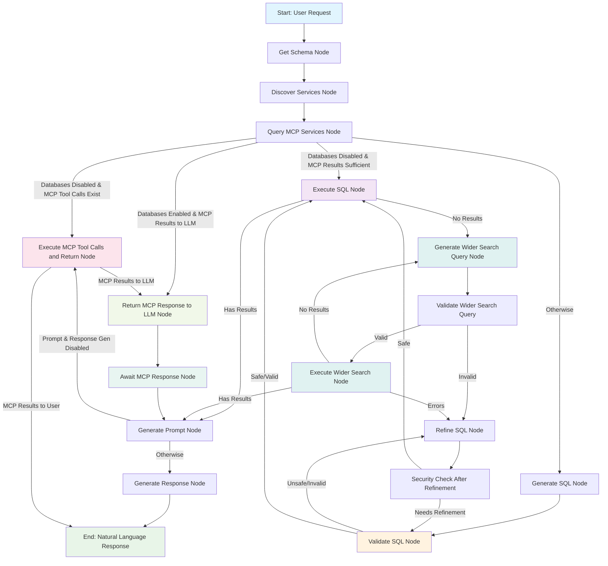

# Architecture Diagram

## LangGraph Workflow Visualization

## Node Descriptions

### 1. Get Schema Node
- Retrieves database schema from all available databases
- Creates table-to-database mappings
- Combines schema information from multiple databases

### 2. Discover Services Node
- Discovers MCP services from the registry
- Retrieves service information including host, port, type, and metadata
- Stores discovered services in state for later use

### 3. Query MCP Services Node
- Queries MCP services for information before attempting SQL database queries
- Uses dedicated MCP model to generate appropriate tool calls
- Executes tool calls against discovered services
- Integrates MCP results with database query results

### 4. Generate SQL Node
- Generates SQL query based on user request and schema
- Considers history of previous SQL queries to avoid repetition
- Incorporates error feedback from previous attempts

### 5. Validate SQL Node
- Performs security validation using dual-layer approach
- Basic keyword matching and LLM-based security analysis
- Checks for potentially harmful commands and SQL injection patterns

### 6. Execute SQL Node
- Executes SQL query on appropriate databases based on table-to-database mapping
- Handles cross-database queries when needed
- Collects results from multiple databases

### 7. Refine SQL Node
- Refines SQL query based on execution results or errors
- Uses error feedback to improve query generation
- Considers previous errors when generating new queries

### 8. Security Check After Refinement
- Performs additional security validation on refined queries
- Ensures refined queries meet security requirements
- Routes back to validation if needed

### 9. Generate Wider Search Query Node
- Activates when initial query returns no results
- Generates alternative search strategies based on schema analysis
- Considers history of previous attempts to avoid repetition

### 10. Execute Wider Search Node
- Executes wider search queries across databases
- Continues until results are found or maximum attempts reached
- Handles execution errors and retries as needed

### 11. Generate Prompt Node
- Creates specialized prompt for response generation
- Incorporates user request and database results
- Formats information for natural language processing
- Includes MCP service results when available

### 12. Generate Response Node
- Converts database results into natural language response
- Produces human-readable output based on query results
- Returns final response to user

### 13. Execute MCP Tool Calls and Return Node
- Executes MCP tool calls and returns results when both prompt and response generation are disabled
- Handles cases where databases are disabled but MCP services are available
- Routes MCP results appropriately based on configuration

### 14. Return MCP Response to LLM Node
- Returns MCP responses directly to the LLM model when initiated by the LLM
- Processes MCP results for further handling by the LLM
- Enables LLM to incorporate MCP results into its response

### 15. Await MCP Response Node
- Awaits MCP response from the LLM model that was called with the MCP results
- Ensures LLM processes MCP results before proceeding with prompt generation
- Coordinates the flow between MCP processing and response generation

## Key Features Highlighted

- **State Management**: All nodes maintain and update state information
- **Error Handling**: Multiple retry mechanisms and error recovery paths
- **Security**: Dual-layer validation at multiple points in the workflow
- **Multi-Database Support**: Automatic routing based on table-to-database mappings
- **Wider Search**: Automatic activation when initial queries return no results
- **Query History**: Maintains history of all generated queries to prevent repetition
- **MCP Integration**: Discovery and interaction with external services via Model Context Protocol
- **MCP Service Results Integration**: MCP results are incorporated with database query results
- **Conditional Routing**: Sophisticated routing based on database availability and MCP results
- **Component Disabling**: Option to disable database operations, prompt generation, or response generation