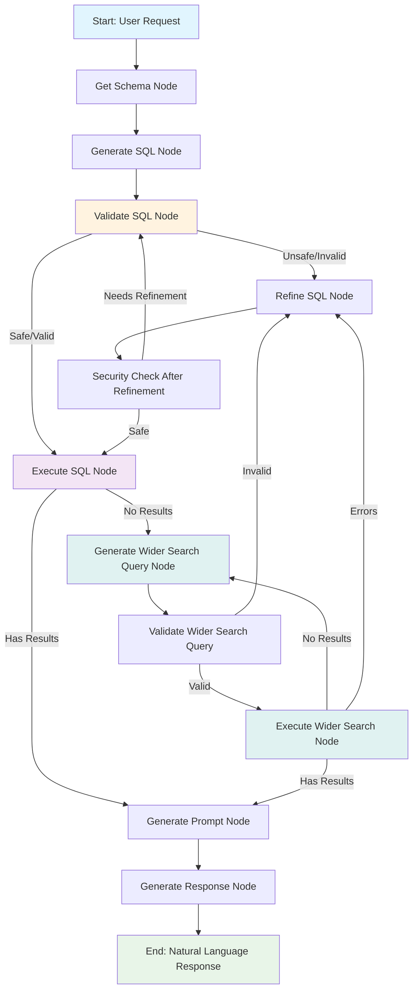

# Architecture Diagram

## LangGraph Workflow Visualization

## Node Descriptions

### 1. Get Schema Node
- Retrieves database schema from all available databases
- Creates table-to-database mappings
- Combines schema information from multiple databases

### 2. Generate SQL Node
- Generates SQL query based on user request and schema
- Considers history of previous SQL queries to avoid repetition
- Incorporates error feedback from previous attempts

### 3. Validate SQL Node
- Performs security validation using dual-layer approach
- Basic keyword matching and LLM-based security analysis
- Checks for potentially harmful commands and SQL injection patterns

### 4. Execute SQL Node
- Executes SQL query on appropriate databases based on table-to-database mapping
- Handles cross-database queries when needed
- Collects results from multiple databases

### 5. Refine SQL Node
- Refines SQL query based on execution results or errors
- Uses error feedback to improve query generation
- Considers previous errors when generating new queries

### 6. Security Check After Refinement
- Performs additional security validation on refined queries
- Ensures refined queries meet security requirements
- Routes back to validation if needed

### 7. Generate Wider Search Query Node
- Activates when initial query returns no results
- Generates alternative search strategies based on schema analysis
- Considers history of previous attempts to avoid repetition

### 8. Execute Wider Search Node
- Executes wider search queries across databases
- Continues until results are found or maximum attempts reached
- Handles execution errors and retries as needed

### 9. Generate Prompt Node
- Creates specialized prompt for response generation
- Incorporates user request and database results
- Formats information for natural language processing

### 10. Generate Response Node
- Converts database results into natural language response
- Produces human-readable output based on query results
- Returns final response to user

## Key Features Highlighted

- **State Management**: All nodes maintain and update state information
- **Error Handling**: Multiple retry mechanisms and error recovery paths
- **Security**: Dual-layer validation at multiple points in the workflow
- **Multi-Database Support**: Automatic routing based on table-to-database mappings
- **Wider Search**: Automatic activation when initial queries return no results
- **Query History**: Maintains history of all generated queries to prevent repetition