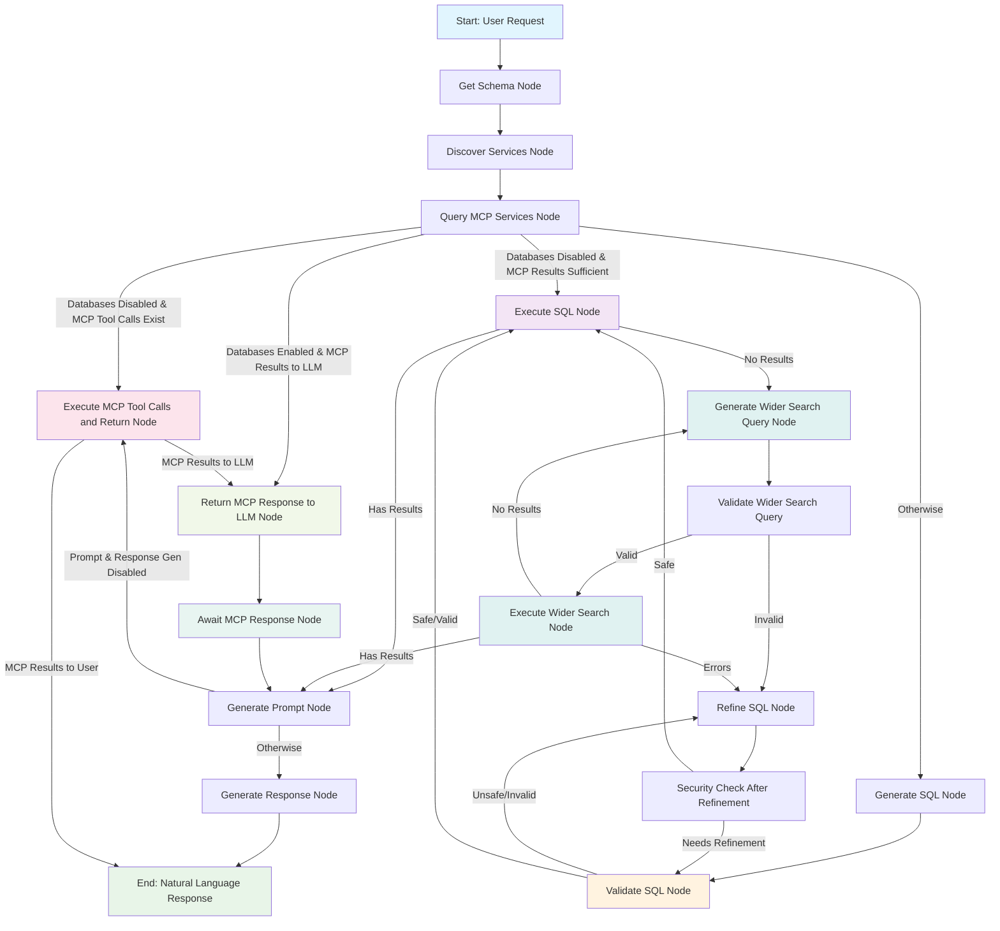
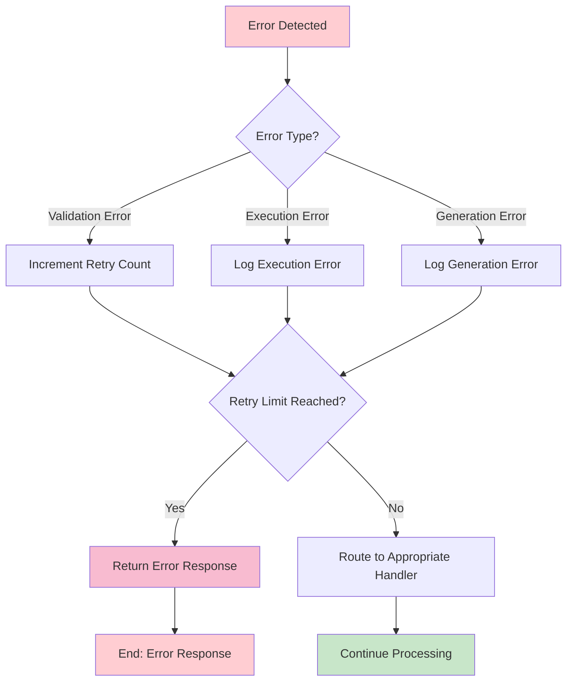
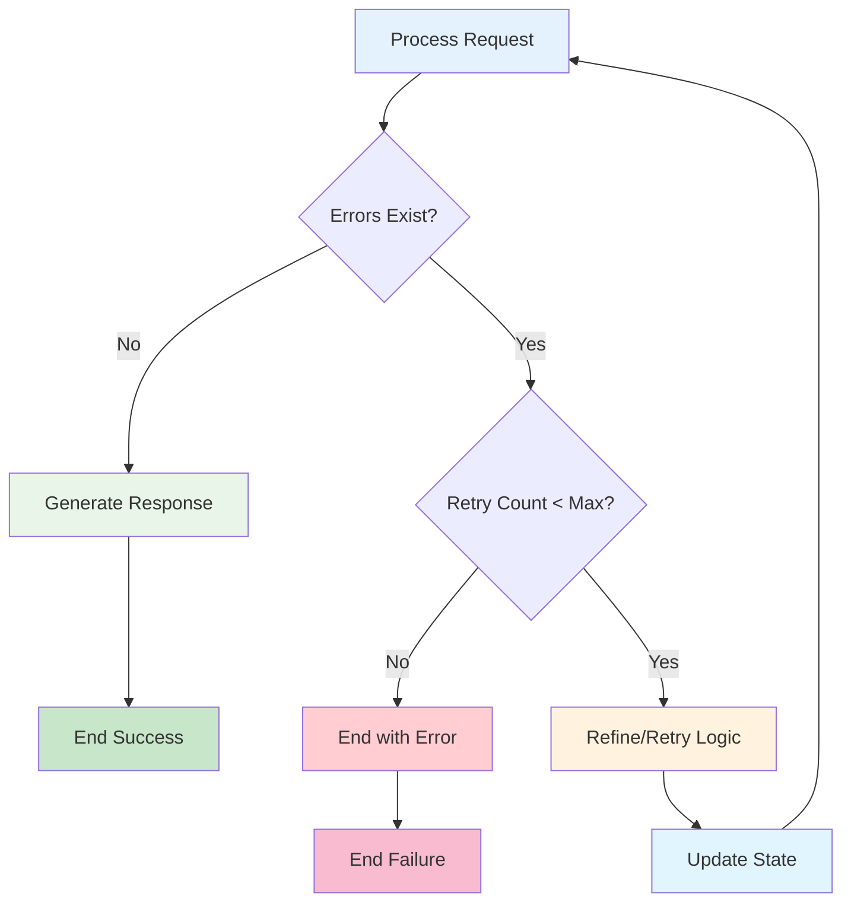
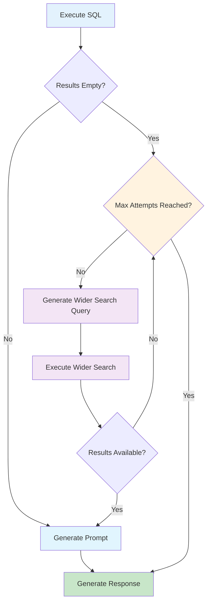
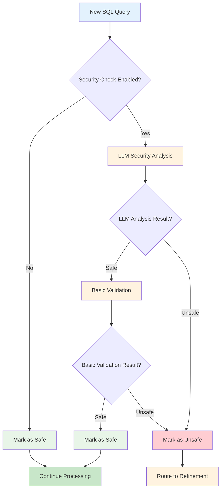

# Workflow Diagrams

## Main Workflow Diagram

```mermaid
graph TD
    A[Start: User Request] --> B[Get Schema Node]
    B --> C[Discover Services Node]
    C --> D[Query MCP Services Node]

    D -->|Databases Disabled & MCP Tool Calls Exist| Z[Execute MCP Tool Calls and Return Node]
    D -->|Databases Disabled & MCP Results Sufficient| H[Generate Prompt Node]
    D -->|Databases Enabled & MCP Results to LLM| AA[Return MCP Response to LLM Node]
    D -->|Otherwise| E[Generate SQL Node]

    E --> F[Validate SQL Node]
    F -->|Unsafe/Invalid| G[Refine SQL Node]
    F -->|Safe/Valid| H[Execute SQL Node]

    G --> I[Security Check After Refinement]
    I -->|Needs Refinement| F
    I -->|Safe| H

    H -->|Has Results| J[Generate Prompt Node]
    H -->|No Results| K[Generate Wider Search Query Node]

    J -->|Prompt & Response Gen Disabled| Z
    J -->|Otherwise| L[Generate Response Node]

    L --> M[End: Natural Language Response]

    K --> N[Validate Wider Search Query]
    N -->|Invalid| G
    N -->|Valid| O[Execute Wider Search Node]

    O -->|Has Results| J
    O -->|No Results| K
    O -->|Errors| G

    AA --> BB[Await MCP Response Node]
    BB --> J

    Z -->|MCP Results to LLM| AA
    Z -->|MCP Results to User| M

    style A fill:#e1f5fe
    style M fill:#e8f5e8
    style F fill:#fff3e0
    style H fill:#f3e5f5
    style K fill:#e0f2f1
    style O fill:#e0f2f1
    style Z fill:#fce4ec
    style AA fill:#f1f8e9
    style BB fill:#e8f5f1
```

## Error Handling Flow Diagram

```mermaid
graph TD
    A[Error Detected] --> B{Error Type?}
    
    B -->|Validation Error| C[Increment Retry Count]
    B -->|Execution Error| D[Log Execution Error]
    B -->|Generation Error| E[Log Generation Error]
    
    C --> F{Retry Limit Reached?}
    D --> F
    E --> F
    
    F -->|Yes| G[Return Error Response]
    F -->|No| H[Route to Appropriate Handler]
    
    G --> I[End: Error Response]
    H --> J[Continue Processing]
    
    style A fill:#ffcdd2
    style G fill:#f8bbd0
    style I fill:#ffcdd2
    style J fill:#c8e6c9
```

## Retry Mechanism Diagram

```mermaid
graph TD
    A[Process Request] --> B{Errors Exist?}
    
    B -->|No| C[Generate Response]
    B -->|Yes| D{Retry Count < Max?}
    
    C --> E[End Success]
    D -->|No| F[End with Error]
    D -->|Yes| G[Refine/Retry Logic]
    
    F --> H[End Failure]
    G --> I[Update State]
    I --> A
    
    style A fill:#e3f2fd
    style C fill:#e8f5e8
    style E fill:#c8e6c9
    style F fill:#ffcdd2
    style H fill:#f8bbd0
    style G fill:#fff3e0
    style I fill:#e1f5fe
```

## Wider Search Activation Diagram

```mermaid
graph TD
    A[Execute SQL] --> B{Results Empty?}
    
    B -->|No| C[Generate Prompt]
    B -->|Yes| D{Max Attempts Reached?}
    
    C --> E[Generate Response]
    D -->|Yes| E
    D -->|No| F[Generate Wider Search Query]
    
    F --> G[Execute Wider Search]
    G --> H{Results Available?}
    
    H -->|Yes| C
    H -->|No| D
    
    style A fill:#e3f2fd
    style C fill:#e1f5fe
    style E fill:#c8e6c9
    style F fill:#f3e5f5
    style G fill:#f3e5f5
    style D fill:#fff3e0
```

## Security Validation Flow Diagram

```mermaid
graph TD
    A[New SQL Query] --> B{Security Check Enabled?}
    
    B -->|No| C[Mark as Safe]
    B -->|Yes| D[LLM Security Analysis]
    
    D --> E{LLM Analysis Result?}
    E -->|Safe| F[Basic Validation]
    E -->|Unsafe| G[Mark as Unsafe]
    
    F --> H{Basic Validation Result?}
    H -->|Safe| I[Mark as Safe]
    H -->|Unsafe| G
    
    C --> J[Continue Processing]
    G --> K[Route to Refinement]
    I --> J
    
    style A fill:#e3f2fd
    style D fill:#fff3e0
    style F fill:#fff3e0
    style C fill:#e8f5e8
    style G fill:#ffcdd2
    style I fill:#e8f5e8
    style J fill:#c8e6c9
    style K fill:#fff3e0
```